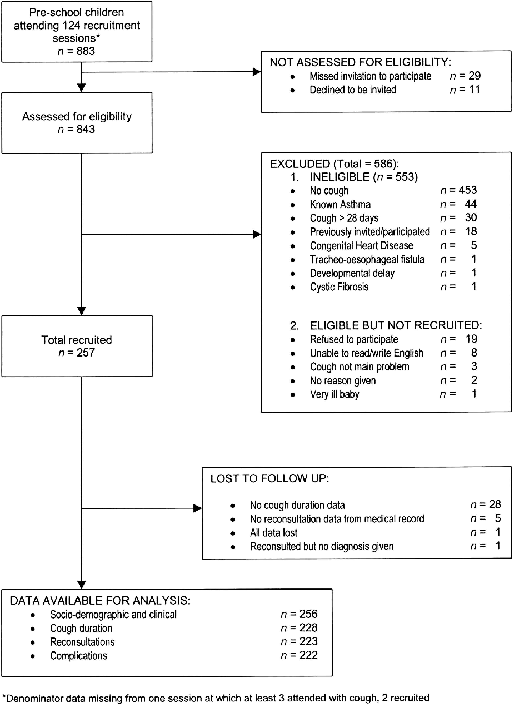

# Results: Participants (13)  
> The items from STROBE state that you should report:  
-	Report the numbers of individuals at each stage of the study e.g., numbers potentially eligible, examined for eligibility, confirmed eligible, included in the study, completing follow up, and analyzed (13a)  
-	Give reasons for nonparticipation at each stage (13b)  
-	Consider use of a flow diagram (13c)  

 
The Results section should give a factual account of what was found, from the recruitment of study participants, the description of the study population to the main results and ancillary analyses. It should be free of interpretations and discursive text reflecting the authors' views and opinions. [@vandenbroucke2007]  
 

**Some key items to consider adding:**  
- The reasons for loss of data and/or participants at each stage  
- The number of individuals excluded based on missing, incomplete, or implausible data  
- The estimated design effect for outcomes of interest  
- The use of an organizational structure diagram if you have dealing with related or matched participants (e.g., families, cases and controls)  
 

## Explanation 13a  
> Detailed information on the process of recruiting study participants is important for several reasons. Those included in a study often differ in relevant ways from the target population to which results are applied. This may result in estimates of prevalence or incidence that do not reflect the experience of the target population. For example, people who agreed to participate in a postal survey of sexual behaviour attended church less often, had less conservative sexual attitudes and earlier age at first sexual intercourse, and were more likely to smoke cigarettes and drink alcohol than people who refused. [@dunne1997] These differences suggest that postal surveys may overestimate sexual liberalism and activity in the population. Such response bias (see [box 3][Box 3. Bias]) can distort exposure-disease associations if associations differ between those eligible for the study and those included in the study. As another example, the association between young maternal age and leukemia in offspring, which has been observed in some case-control studies, [@schulz1999; @cnattingius1995] was explained by differential participation of young women in case and control groups. Young women with healthy children were less likely to participate than those with unhealthy children.[@schulz2003] Although low participation does not necessarily compromise the validity of a study, transparent information on participation and reasons for nonparticipation is essential. Also, as there are no universally agreed definitions for participation, response or follow-up rates, readers need to understand how authors calculated such proportions. [@slattery1995]  
 
Ideally, investigators should give an account of the numbers of individuals considered at each stage of recruiting study participants, from the choice of a target population to the inclusion of participants’ data in the analysis. Depending on the type of study, this may include the number of individuals considered to be potentially eligible, the number assessed for eligibility, the number found to be eligible, the number included in the study, the number examined, the number followed up and the number included in the analysis. Information on different sampling units may be required, if sampling of study participants is carried out in two or more stages as in the example above (multistage sampling). In case-control studies, we advise that authors describe the flow of participants separately for case and control groups. [@schulz2002] Controls can sometimes be selected from several sources, including, for example, hospitalized patients and community dwellers. In this case, we recommend a separate account of the numbers of participants for each type of control group. Olson and colleagues proposed useful reporting guidelines for controls recruited through random-digit dialling and other methods. [@olson2002]  
 
A recent survey of epidemiological studies published in 10 general epidemiology, public health and medical journals found that some information regarding participation was provided in 47 of 107 case-control studies (59%), 49 of 154 cohort studies (32%), and 51 of 86 cross-sectional studies (59%). [@morton2006] Incomplete or absent reporting of participation and nonparticipation in epidemiological studies was also documented in two other surveys of the literature. [@pocock2004; @tooth2005] Finally, there is evidence that participation in epidemiological studies may have declined in recent decades, [@morton2006; @olson2001] which underscores the need for transparent reporting. [@sandler2002; @vandenbroucke2007]  
 

## Example 13a  
- "Of the 105 freestanding bars and taverns sampled, 13 establishments were no longer in business and 9 were located in restaurants, leaving 83 eligible businesses. In 22 cases, the owner could not be reached by telephone despite 6 or more attempts. The owners of 36 bars declined study participation. (...) The 25 participating bars and taverns employed 124 bartenders, with 67 bartenders working at least 1 weekly daytime shift. Fifty-four of the daytime bartenders (81%) completed baseline interviews and spirometry; 53 of these subjects (98%) completed follow-up." [@eisner1998; @vandenbroucke2007]
  

## Explanation 13b  
> Explaining the reasons why people no longer participated in a study or why they were excluded from statistical analyses helps readers judge whether the study population was representative of the target population and whether bias was possibly introduced. For example, in a cross-sectional health survey, non-participation due to reasons unlikely to be related to health status (for example, the letter of invitation was not delivered because of an incorrect address) will affect the precision of estimates but will probably not introduce bias. Conversely, if many individuals opt out of the survey because of illness, or perceived good health, results may underestimate or overestimate the prevalence of ill health in the population. [@vandenbroucke2007]  
 

## Example 13b  
- “The main reasons for non-participation were the participant was too ill or had died before interview (cases 30%, controls < 1%), nonresponse (cases 2%, controls 21%), refusal (cases 10%, controls 29%), and other reasons (refusal by consultant or general practitioner, non-English speaking, mental impairment) (cases 7%, controls 5%).” [@hepworth2006; @vandenbroucke2007]

  

## Explanation 13c  
> An informative and well-structured flow diagram can readily and transparently convey information that might otherwise require a lengthy description,[@egger2001] as in the example above. The diagram may usefully include the main results, such as the number of events for the primary outcome. While we recommend the use of a flow diagram, particularly for complex observational studies, we do not propose a specific format for the diagram. [@vandenbroucke2007]  

 

## Example 13c 

Flow diagram from Hay et al. [@hay2003]      
https://doi.org/10.1371/journal.pmed.0040297.g001

  

## Field-specific guidance  
**Genetic association studies [@little2009]**  
- Report numbers of individuals in whom genotyping was attempted and numbers of individuals in whom genotyping was successful   

**Infectious disease molecular epidemiology [@field2014]**  
- Report numbers of participants and samples at each stage of the study, including the number of samples obtained, the number typed, and the number yielding data  
- If the study investigates groups of genetically indistinguishable pathogens (molecular clusters), state the sampling fraction, the distribution of cluster sizes, and the study population turnover, if known   

**Medical abortion [@creinin2016]**  
- Report the number of participants who started medical abortion treatment and the number who did not complete any follow-up for each cohort and by gestational age  
- Report the number of participants used in the denominator for outcome evaluation for each cohort and by gestational age, which most commonly will be the number of women with any follow-up  
- Include a description of the number of women who used the drug(s) as planned in the protocol (treatment adherence)  
- When more than one drug is used (e.g. mifepristone and a prostaglandin analog), the actual time interval between the agents should be reported, preferably in hours   

**Neonatal infections [@fitchett2016]**  
- See figure 2 for suggested components of a flow diagram for neonatal infections    

**Response-driven sampling [@white2015]**  
- Report number of coupons issued and returned  
- Report number of recruits by seed and number of RDS recruitment waves for each seed. Consider showing graph of entire recruitment network  
- Report recruitment challenges (e.g., commercial exchange of coupons, imposters, duplicate recruits) and how addressed     

**Routinely collected health data [@benchimol2015]**  
- Describe in detail the selection of the persons included in the study (i.e., study population selection), including filtering based on data quality, data availability, and linkage. The selection of included persons can be described in the text and/or by means of the study flow diagram   

**Veterinary epidemiology [@oconnor2016]** 
- Report the numbers of owners/managers and animals at each stage of study and at each relevant level of organization - e.g, numbers eligible, included in the study, completing follow-up, and analyzed   
- Give reasons for non-participation at each stage and at each relevant level of organization  
 

## Resources  
Do you know of any good guidance or resources related to this item? Suggest them via comments below, [Twitter](https://twitter.com/sharpmelk), [GitHub](https://github.com/sharpmel/STROBECourse), or [e-mail](mailto:melissaksharp@gmail.com).