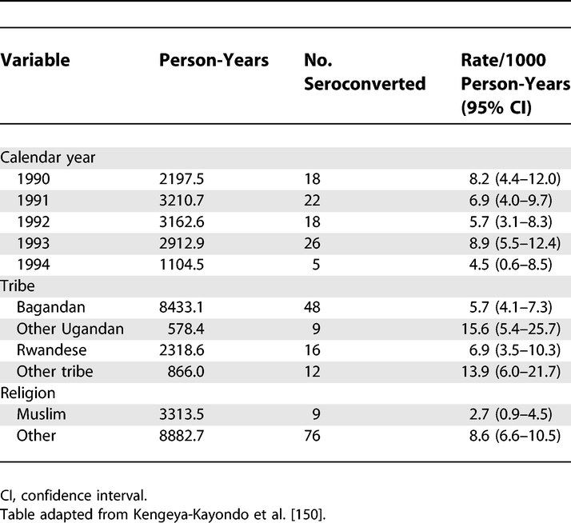
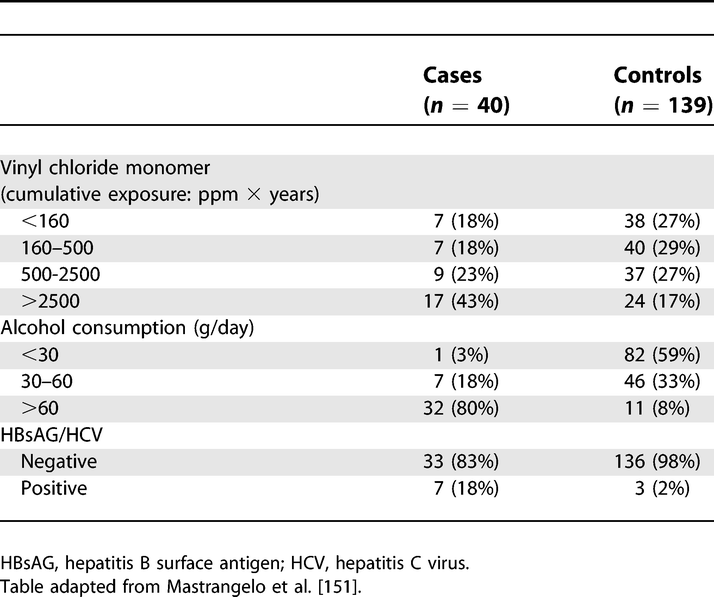
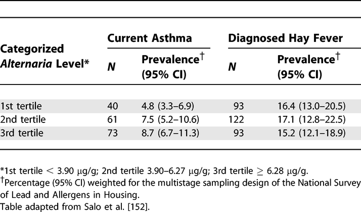

# Results: Outcome Data (15)
>The items from STROBE state that you should report:  
- Cohort study Report numbers of outcome events or summary measures over time  
- Case-control study Report numbers in each exposure category, or summary measures of exposure  
- Cross-sectional study Report numbers of outcome events or summary measures  

  

**Some key items to consider adding:**  
- Consider the use of a tabular or graphical presentation (Kaplan–Meier, cumulative incidence plot) of the outcome over time for the exposed and comparison cohort  
- Report outcomes as appropriate for the study design and summarize at all relevant levels of organization  
- For proportions and rates, report the numerator and denominator  
- For continuous outcomes, report the number of observations and a measure of variability  

  

## Explanation  
> Before addressing the possible association between exposures (risk factors) and outcomes, authors should report relevant descriptive data. It may be possible and meaningful to present measures of association in the same table that presents the descriptive data (see item 14a). In a cohort study with events as outcomes, report the numbers of events for each outcome of interest. Consider reporting the event rate per person-year of follow-up. If the risk of an event changes over follow-up time, present the numbers and rates of events in appropriate intervals of follow-up or as a Kaplan-Meier life table or plot. It might be preferable to show plots as cumulative incidence that go up from 0% rather than down from 100%, especially if the event rate is lower than, say, 30%.153 Consider presenting such information separately for participants in different exposure categories of interest. If a cohort study is investigating other time-related outcomes (eg, quantitative disease markers such as blood pressure), present appropriate summary measures (eg, means and standard deviations) over time, perhaps in a table or figure.  
 
For cross-sectional studies, we recommend presenting the same type of information on prevalent outcome events or summary measures. For case-control studies, the focus will be on reporting exposures separately for cases and controls as frequencies or quantitative summaries.154 For all designs, it may be helpful also to tabulate continuous outcomes or exposures in categories, even if the data are not analyzed as such.[@vandenbroucke2007]  

## Examples
## 15 cohort example
Table.

Rates of HIV-1 Seroconversion by Selected Sociodemographic Variables: 1990–1993
https://doi.org/10.1371/journal.pmed.0040297.t004

##case-control study
Table.

Exposure among Liver Cirrhosis Cases and Controls
https://doi.org/10.1371/journal.pmed.0040297.t006

## cross-sectional
Table.

Prevalence of Current Asthma and Diagnosed Hay Fever by Average Alternaria alternata Antigen Level in the Household
https://doi.org/10.1371/journal.pmed.0040297.t007
  

## Field-specific guidance  
**Genetic association studies [@little2009]**  
- Cohort: Report outcomes (phenotypes) for each genotype category over time  
- Report numbers in each genotype category  
- Cross-sectional: Report outcomes (phenotypes) for each genotype category  

**Neonatal infections [@fitchett2016]**  
- Report the number (and the proportion) of samples microbiologically tested (including lumbar punctures for meningitis cases); the number (and the proportion) that were positive (including thresholds for detection, where applicable); all isolates obtained (including clinically significant and nonsignificant); and antimicrobial susceptibilities of pathogens, where done  
- Report the number (and the proportion) of babies with microbiologically proven infection (and number of infections per baby), and include this in the fl ow chart (see figure 2)  
- Report infections by day, for days 0–6. State age categories, if used, defining early-onset and late-onset infection (eg, <72 h and ≥72 h, respectively)  
- Report deaths and any subanalyses by risk groups  

 
## Resources  
Do you know of any good guidance or resources related to this item? Suggest them via comments below, [Twitter](https://twitter.com/sharpmelk), [GitHub](https://github.com/sharpmel/STROBECourse), or [e-mail](mailto:melissaksharp@gmail.com).
