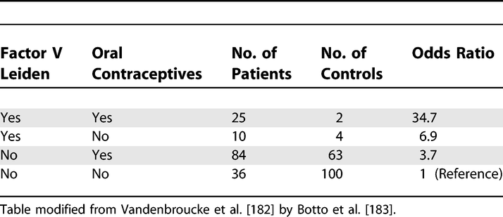
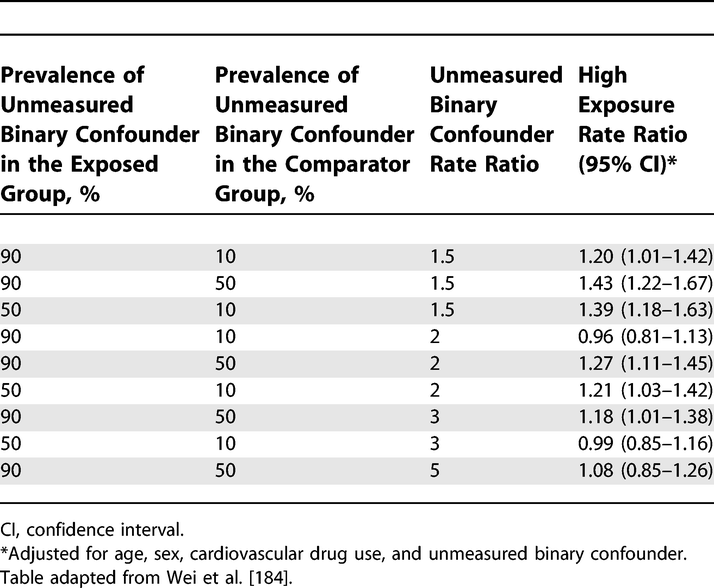

# Results: Other Analyses (17)  
> The items from STROBE state that you should report:  
-	Report other analyses done e.g., analyses of subgroups and interactions, and sensitivity analyses  

  

**Some key items to consider adding:**   
-	Consider performing analyses to explore possible effect modification  
-	Consider performing sensitivity/robustness analyses for differing definitions of exposure and outcome or different statistical models  
-	If detailed results are available elsewhere, state how they can be accessed  
-	Report exclusion of misreporters, outliers, and data imputation  

  

## Explanation  
> In addition to the main analysis other analyses are often done in observational studies. They may address specific subgroups, the potential interaction between risk factors, the calculation of attributable risks, or use alternative definitions of study variables in sensitivity analyses.  
 
There is debate about the dangers associated with subgroup analyses, and multiplicity of analyses in general. [@pocock2004; @gotzsche2006] In our opinion, there is too great a tendency to look for evidence of subgroup-specific associations, or effect-measure modification, when overall results appear to suggest little or no effect. On the other hand, there is value in exploring  whether an overall association appears consistent across several, preferably pre-specified subgroups especially when a study is large enough to have sufficient data in each subgroup. A second area of debate is about interesting subgroups that arose during the data analysis. They might be important findings, but might also arise by chance. Some argue that it is neither possible nor necessary to inform the reader about all subgroup analyses done as future analyses of other data will tell to what extent the early exciting findings stand the test of time. [@rothman1990] We advise authors to report which analyses were planned, and which were not (see also items [4][Methods: Study Design (4)], [12b][Explanation 12b] and [20][Discussion: Interpretation (20)]). This will allow readers to judge the implications of multiplicity, taking into account the study’s position on the continuum from discovery to verification or refutation.  
 
A third area of debate is how joint effects and interactions between risk factors should be evaluated: on additive or  multiplicative scales, or should the scale be determined by the statistical model that fits best (see also [item 12b][Explanation 12b] and [box 8][Box 8. Interaction (effect modification)])? A sensible approach is to report the separate effect of each exposure as well as the joint effect – if possible in a table, as in the first example above,[183] or in the study by Martinelli et al. [@martinelli2003] Such a table gives the reader sufficient information to evaluate additive as well as multiplicative interaction (how these calculations are done is shown in [box 8][Box 8. Interaction (effect modification)]).  
 
Confidence intervals for separate and joint effects may help the reader to judge the strength of the data. In addition, confidence intervals around measures of interaction, such as the Relative Excess Risk from Interaction (RERI) relate to tests of interaction or homogeneity tests. One recurrent problem is that authors use comparisons of P values across subgroups, which lead to erroneous claims about an effect modifier. For instance, a statistically significant association in one category (eg, men), but not in the other (eg, women) does not in itself provide evidence of effect modification. Similarly, the confidence intervals for each point estimate are sometimes inappropriately used to infer that there is no interaction whintervals overlap. A more valid inference is achieved by directly evaluating whether the magnitude of an association differs across subgroups.  
 
Sensitivity analyses are helpful to investigate the influence of choices made in the statistical analysis, or to investigate the robustness of the findings to missing data or possible biases (see also item [12b][Explanation 12b]). Judgement is needed regarding the level of reporting of such analyses. If many sensitivity analyses were performed, it may be impractical to present detailed findings for them all. It may sometimes be sufficient to report that sensitivity analyses were carried out and that they were consistent with the main results presented. Detailed presentation is more appropriate if the issue investigated is of major concern, or if effect estimates vary considerably.[@anderson2005; @kyzas2005]
 
Pocock and colleagues found that 43 out of 73 articles reporting observational studies contained subgroup analyses. The majority claimed differences across groups but only eight articles reported a formal evaluation of interaction (see [item 12b][Explanation 12b]).[@pocock2004; @vandenbroucke2007]  

## Examples  
**Example 1**  
  
Analysis of Oral Contraceptive Use, Presence of Factor V Leiden Allele, and Risk for Venous Thromboembolism  
https://doi.org/10.1371/journal.pmed.0040297.t009

  

**Example 2**
  
Sensitivity of the Rate Ratio for Cardiovascular Outcome to an Unmeasured Confounder  
https://doi.org/10.1371/journal.pmed.0040297.t010

## Box 8. Interaction (effect modification)  
- **The analysis of joint effects**  
Interaction exists when the association of an exposure with the risk of disease differs in the presence of another exposure. One problem in evaluating and reporting interactions is that the effect of an exposure can be measured in two ways: as a relative risk (or rate ratio) or as a risk difference (or rate difference). The use of the relative risk leads to a multiplicative model, while the use of the risk difference corresponds to an additive model [@rothman1980; @saracci1980]. A distinction is sometimes made between ‘statistical interaction' which can be a departure from either a multiplicative or additive model, and ‘biologic interaction' which is measured by departure from an additive model [@rothman2002]. However, neither additive nor multiplicative models point to a particular biologic mechanism.    
Regardless of the model choice, the main objective is to understand how the joint effect of two exposures differs from their separate effects (in the absence of the other exposure). The Human Genomic Epidemiology Network (HuGENet) proposed a lay-out for transparent presentation of separate and joint effects that permits evaluation of different types of interaction [@botto2001]. Data from the study on oral contraceptives and factor V Leiden mutation [@vandenbroucke1994] were used to explain the proposal, and this example is also used in item 17. Oral contraceptives and factor V Leiden mutation each increase the risk of venous thrombosis; their separate and joint effects can be calculated from the 2 by 4 table (see example 1 for [item 17) where the odds ratio of 1 denotes the baseline of women without Factor V Leiden who do not use oral contraceptives.  
 
A difficulty is that some study designs, such as case-control studies, and several statistical models, such as logistic or Cox regression models, estimate relative risks (or rate ratios) and intrinsically lead to multiplicative modelling. In these instances, relative risks can be translated to an additive scale. In example 1 of item 17, the separate odds ratios are 3.7 and 6.9; the joint odds ratio is 34.7. When these data are analysed under a multiplicative model, a joint odds ratio of 25.7 is expected (3.7 × 6.9). The observed joint effect of 34.7 is 1.4 times greater than expected on a multiplicative scale (34.7/25.7). This quantity (1.4) is the odds ratio of the multiplicative interaction. It would be equal to the antilog of the estimated interaction coefficient from a logistic regression model. Under an additive model the joint odds ratio is expected to be 9.6 (3.7 + 6.9 – 1). The observed joint effect departs strongly from additivity: the difference is 25.1 (34.7 – 9.6). When odds ratios are interpreted as relative risks (or rate ratios), the latter quantity (25.1) is the Relative Excess Risk from Interaction (RERI) [@rothman1986]. This can be understood more easily when imagining that the reference value (equivalent to OR=1) represents a baseline incidence of venous thrombosis of, say, 1/10 000 women-years, which then increases in the presence of separate and joint exposures.  
  

## Field-specific guidance  
**Anti-microbial stewardship programs [@tacconelli2016]**  
- Report subgroup analysis by type of patients and type of microorganism, if applicable   

**Genetic association studies [@little2009]**  
- If numerous genetic exposures (genetic variants) were examined, summarize results from all analyses undertaken   

**Response-driven sampling [@white2015]**  
- Report other analyses done—for example, analyses of subgroups and interactions, sensitivity analyses, different RDS estimators and definitions of personal network size   

## Resources  
Do you know of any good guidance or resources related to this item? Suggest them via comments below, [Twitter](https://twitter.com/sharpmelk), [GitHub](https://github.com/sharpmel/STROBECourse), or [e-mail](mailto:melissaksharp@gmail.com).
  