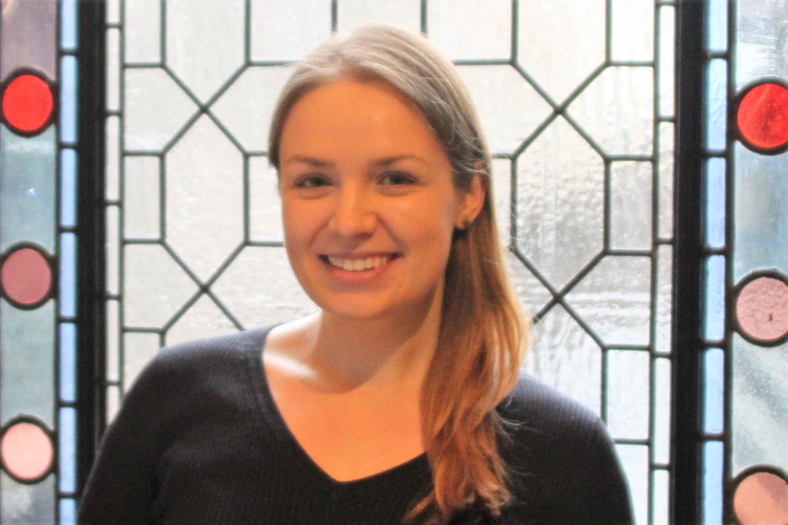

# About the Author  

Melissa Sharp completed this project as part of her work as a Marie Skłodowska-Curie doctoral research fellow at The University of Split and University of Paris within the Methods in Research on Research (MiRoR) Project. Her PhD, funded by the European Union Horizon 2020 research and innovation program, focuses on the STrengthening the Reporting of OBservational studies in Epidemiology (STROBE) reporting guideline. It looks into micro- and macro-level facilitators and barriers that influence the use of STROBE and reporting guidelines like it.
  
She previously earned a Masters in Public Health in Epidemiology with a Graduate Certificate in Public Health Informatics from Columbia University Mailman School of Public Health and a Bachelor of Science in Psychology and Minor in Women and Gender Studies from Michigan State University. For more information such as CV, research interests, and contact information, please [visit her website](http://www.melissaksharp.wordpress.com).    

<b>STROBE Statement</b>  
<i><b> Acknowledgments </b> : We are grateful to Gerd Antes, Kay Dickersin, Shah Ebrahim and Richard Lilford for supporting the STROBE Initiative. We are grateful to the following institutions that have hosted working meetings: Institute of Social and Preventive Medicine (ISPM), University of Bern, Switzerland; Department of Social Medicine, University of Bristol, UK; London School of Hygiene & Tropical Medicine, London, UK; Nordic Cochrane Centre, Copenhagen, Denmark; and Centre for Statistics in Medicine, Oxford, UK. We are grateful to four anonymous reviewers who provided helpful comments on a previous draft of this paper.  
<b> Contributors to the STROBE Initiative </b> : The following persons have contributed to the content and elaboration of the STROBE Statement: Douglas G. Altman, Maria Blettner, Paolo Boffetta, Hermann Brenner, Geneviève Chêne, Cyrus Cooper, George Davey-Smith, Erik von Elm, Matthias Egger, France Gagnon, Peter C. Gøtzsche, Philip Greenland, Sander Greenland, Claire Infante-Rivard, John Ioannidis, Astrid James, Giselle Jones, Bruno Ledergerber, Julian Little, Margaret May, David Moher, Hooman Momen, Alfredo Morabia, Hal Morgenstern, Cynthia D. Mulrow, Fred Paccaud, Stuart J. Pocock, Charles Poole, Martin Röösli, Dietrich Rothenbacher, Kenneth Rothman, Caroline Sabin, Willi Sauerbrei, Lale Say, James J. Schlesselman, Jonathan Sterne, Holly Syddall, Jan P. Vandenbroucke, Ian White, Susan Wieland, Hywel Williams, Guang Yong Zou. </i> [@vandenbroucke2007] 
