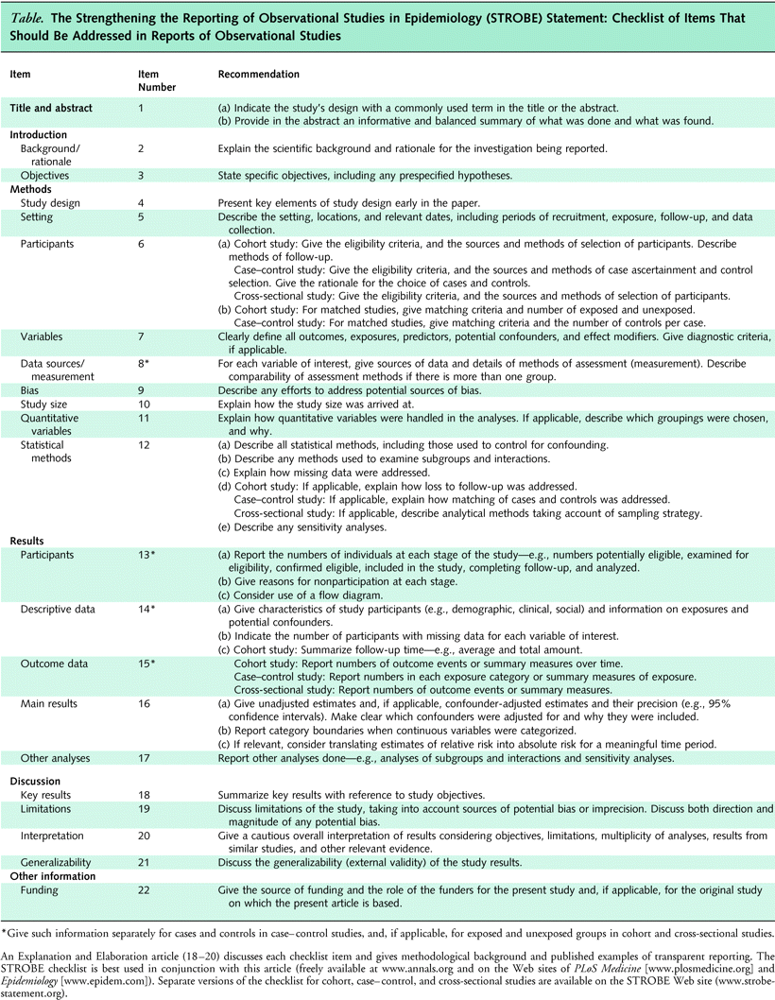

# Introduction {- #intro}
The purpose of this site is to create a public, open-source repository for epidemiological research methods and reporting skills for observational studies. Epidemiology, the study of diseases and population health, is a broad field with ever-changing methods and often heated debates about proper designs, analyses, and approaches. Therefore, we think it is important that there is a place where epidemiologists can share their knowledge in an open and transparent manner. Drawing inspiration from the [#epitwitter community](https://twitter.com/hashtag/epitwitter?lang=en), the [Open Science Massive Online Course](https://opensciencemooc.eu/), and [Data Methods](https://discourse.datamethods.org/), we hope that this will become a living site which can be used and modified by the epidemiology community and those interested in sharing epidemiological knowledge in accessible ways. For a quick peek into how this site works and how you can contribute, please check out the [Frequently Asked Questions page](#faq).
</br>

> This site is uses the [R Bookdown package](https://bookdown.org/), which is built using [R Markdown](http://rmarkdown.rstudio.com). All content is stored in the [GitHub repository](https://github.com/sharpmel/STROBECourse) of [Melissa Sharp](http://melssaksharp.wordpress.com), a doctoral student who worked on observational research methods. Please [contact her](mailto:melissaksharp@gmail.com) if you have any comments, questions, or concerns. 

## Structure {-}
We aim to be as inclusive as possible but are structuring this site on the **[Strengthening the Reporting of Observational studies in Epidemiology (STROBE) reporting guideline](http://strobe-statement.com).** STROBE was created in 2007 and is comprised of a 22-item checklist of essential items to report when discussing the results from a cohort, cross-sectional, or case-control study [@vonelm2007; @vandenbroucke2007]. It has been endorsed by the [International Commitee of Medcial Journal Editors](www.icmje.org/) and hundreds of journals and has spawned at least another 13 field- or method-specific extensions. [@benchimol2015; @cheng2016; @creinin2016 ;@field2014; @horby2017; @gallo2012; @hornell2017; @lachat2016; @little2009; @oconnor2016; @tacconelli2016; @white2015; @zavada2014]
</br>

```{r STROBEChecklist, echo=FALSE, fig.cap="STROBE Checklist", out.width = '100%'}

```

STROBE and this book follows the IMRaD (Introduction, Methods, Results, and Discussion) style of reporting research. The content from STROBE's Explanation and Elaboration document [@vandenbroucke2007] will be included in this site as it explains why each item on the STROBE checklist is important and it gives examples of "good reporting". Additional information will be supplied from the dissertation of Melissa Sharp and the projects contained within it -- particularly results from a qualitative assessment of the content in the STROBE Extensions. [@sharp2018QA] Hopefully, over time, others will contribute additional examples and resources related to each STROBE item.
</br>

Content is designed in a modular format that is aligned with the design of the STROBE Checklist.</br>
-	If you are familiar with epidemiological research methods and STROBE, you can pick and choose what items to explore.
</br> 
-	Otherwise, if you are unexperienced, you can follow the structure in a more linear fashion, beginning with an introduction on the concept of reporting guidelines and their use.  
</br>

## Audience {-}
The content in this book will appeal to those who work in observational research, need a refresher on certain epidemiological topics, or want to improve their scientific writing skills. Some baseline understanding of clinical or public health research may be helpful though since using STROBE should imply that you have or are working in health research. 
</br>

## Content {-}
We hope to help you develop your understanding of study designs, data collection, statistical analysis, and interpretation of results. This site will not cover key aspects of the conduct of research, such as the skills needed for personal interactions with patients and participants, detailed analytical skills, regulatory frameworks, nor science communication skills needed to disseminate your work to the general public. All are important areas influencing items covered in this course but the breadth is too great to go over each area in depth. Rather, we aim to provide supplementary information along the way that will help you explore and grow in these areas if you so wish.
</br>

<h2> Funding Statement and Licensing </h2>
*This site is a project of the Methods in Research on Research (MiRoR) project, supported by the European Union’s Horizon 2020 research and innovation programme under the Marie Sklodowska-Curie grant agreement No 676207.The online version of this book is licensed under the [Creative Commons Attribution-NonCommercial-ShareAlike 4.0 International License](https://creativecommons.org/licenses/by-nc-sa/4.0/).* 
</br>